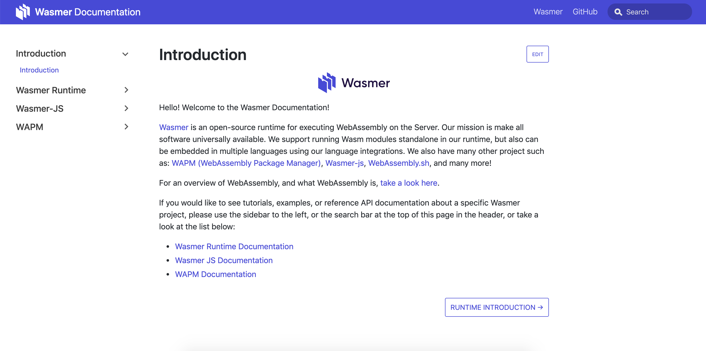

# docs.wasmer.io

Documentation for Wasmer Projects. Powered by [Docusarus](https://docusaurus.io/)

# Contributing

Any and all PRs are welcome! Most pull requests should start by opning an issue so the feature or idea can be discussed before being implemented. 

Contributions most likely will come as:

* Documentation - Improvements to the content of the documentation

* Website - Improvements to the "shell", which is powered by Docusarus.

## Documentation

Documentation updates are super appreciated! Whether it be a small type, the documentation is out of date, or the general document can be improved or shorten! These are all greatly appreciated!

General typo fixes probably don't need an issue to open a PR, but larger contributions like creating a new example can benefit from an issue being created first.

The documentation is divided into three categories:

* Reference API - Very specific API definitions, in which the properties and functions are expressed clearly.
* Examples - Small, one-off copy-pastable snippets of code. That live within a larger, but relatively less complicated project.
* Tutorials - End-to-end documents that explain how to go from nothing, to a testable project on a machine with Wasmer installed.

Reference API documentation may sometimes live out of this documentation, depending on the language. For instance, the Wasmer Rust integration live on [docs.rs](https://docs.rs/wasmer-runtime/0.11.0/wasmer_runtime/index.html). Those docs can be updated there. Examples live in the `docs/[WASMER_PROJECT_SUBDIRECTORY]/examples` directory. Examples should have an entire project in the directory, with a `.md` file for the  example explaining the small sub-project, only highlighting the relevant parts for the purpose. Tutorials live in the `docs/[WASMER_PROJECT_SUBDIRECTORY]/tutorials` directory. These should also have an entire project in them, but most of the content should also be in the `.md` file for the tutorial. In terms of all relevant code parts should be viewable, and explained.

When creating new content, be sure to also add the path to the content in the [docusarus config](https://docusaurus.io/docs/en/site-config).

## Website

Website updates are also super appreciated! Especially for small bugs and things! 

Larger design, technnical, or [docusarus config](https://docusaurus.io/docs/en/site-config) changes to the website "shell", should have an issue associated with them.
