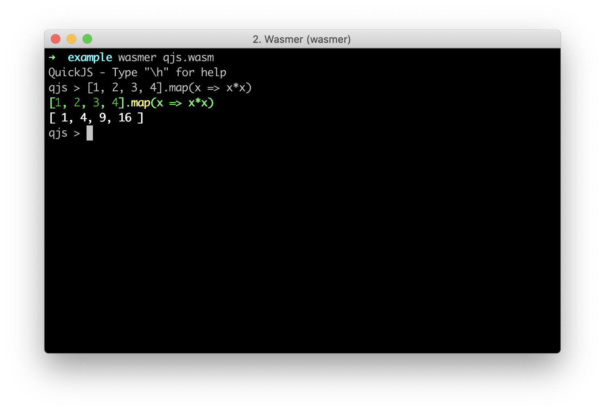

# Getting Started

Otherwise, you can install the Wasmer CLI by following the instructions below:

If you haven't already, Install the Wasmer CLI.

```text
curl https://get.wasmer.io -sSfL | sh
```


For Windows, Wasmer executable can be found on out [Github Releases Page](https://github.com/wasmerio/wasmer/releases).


Once you have the Wasmer CLI installed, you can run `wasm` modules from the command line!

To do this, you want to find a Wasm Module compiled down to an ABI that the Wasmer runtime supports, such as WASI or Emscripten. For instance, we can search for a module on WAPM, and go to the module page, and then click on the "Browse modules" tab.

In this example, we will be using the [QuickJS](https://wapm.io/package/quickjs) compiled to WebAssembly. To do this we would [download the module from WAPM](https://wapm.io/package/quickjs#explore), and then run:

```text
wasmer qjs.wasm
```

Which should bring up the QuickJS prompt which you can then interact with. See an example below:



Next, we can take a look at the command line flags and arguments for the CLI, for more advanced usage.

